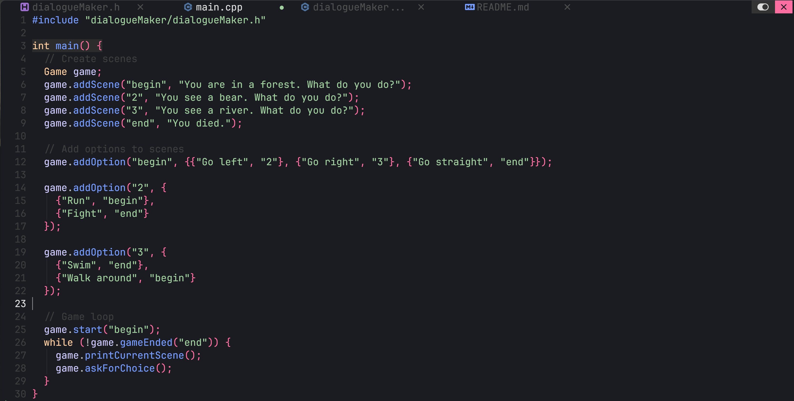

# DialogueMaker

## Documentation
Coming Soon

## How to use
1. Download `src` folder
2. Move into `src` folder
3. Add scenes and choices in `main.cpp`
4. Compile with this command
```
g++ -Wall main.cpp dialogueMaker.cpp -o main -std=c++11
./main
```
## Example



